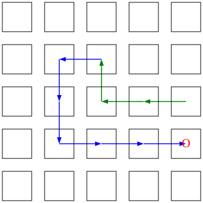

## Problem statement

Several years ago, I wrote a game engine and an AI player for the classic game snake. That AI player uses a serialized pair of A* searches to determine when/how to eat and has fall back logic to simply survive when it cannot find a safe way to eat. While not previously recorded in this repo, the existing AI was named "Pickles" (the Path-finder).
I thought it would be a fun use of Z3 to implement a new AI player; this new player will use SMT to determine/how to eat and will reuse the Pickles' fall back survival logic. This new player is named "Sammy" (the Solver).

## Working prototype

Whether or not I have working prototype is up for debate. Everything I've written here is in the file `single_example.py`. 

Before going into the new code, there are a few things to note about the existing code.
* Each cell of the play field is represented as an integer ordered pair, which are wrapped in a `Point` class. The game engine places point (0, 0) in the top left of the field.
* The body of the snake is encoded as a deque of `Point` objects. Index 0 is the head of the snake, so as the snake moves the new `Point` is added to the front and the old `Point` drops off the back (unless the snake is growing).
* The default growth when the snake eats is 2; most versions do 1. For fiddly reasons that I have half forgotten, keeping the snake's body at even parity makes the AI logic easier.
* Pickles' eating logic ignores the drop off of the tail. This was necessary to keep down the search space for A* and dovetails nicely into the survival logic.
* Suriving means following a set path that we know will get you safely back to where your tail is. That strategy allow the snake to take on the part of Conway's Angel, playing indefinitely.

In my new code, I wanted to start off by getting Sammy to find a path just to the food on a small board.

My code take 3 inputs, which are all attributes of the `Game` object from my existing code.
* `body`: the deque of `Point` objects that currently make up the snake
* `food`: a single `Optional[Point]` of where the next piece of food is located
* `size`: the width of the play field; the field is assumed to be square 

I added these definitions
* `PointSort`: a Z3 Datatype to represent the game's `Point` objects
* `adjacent`: a helper function that takes two `Point` objects and returns the Z3 expression for whether they are adjacent on a square grid
* `inbounds`: a helper function that takes a `Point` object and returns the Z3 expression for whether that point is inside the
* `feed`: a helper function that takes a `Point` object and returns whether that is the food location
* `Path`: a Z3 sequence of `PointSort` object. The objective of the solver is construct this sequence in a valid way.

With that scaffolding in place, these are the constraints:
* The length of `Path` must be more than the current length of the snake, because it will include the current snake (see above, Survival)
* The suffix of the `Path` must represent the same `Point` objects that make up the current snake in the same order (again Survival). The prefix that the solver adds can be used to determine the moves to provide to the game engine.
* For all indexes in the `Path` the `Point` must be `inbounds`.
* For all pairs of i, j with i+1==j, `Path[i]` and `Path[j]` must be `adjacent`.
* For all paris of i, j with i<j, `Path[i]` cannot equal `Path[j]`. i.e. the elements in `Path` must be distinct. Z3's `Distinct` constraint does not seem to work with custom `Datatype` objects.
* There must be some i such that `feed(Path[i])`. i.e. the `Path` must actually eat the food.

The problems arises in actually running the example. Take this example, with the head of the snake at (1, 2) and the food at (3, 4). On my machine the solver takes 8 seconds to find the path in blue; this is unreasonably long.

I also tried running the with the food at (4, 4), just one cell farther. I let it run for multiple hours while I went running and grocery shopping. Despite there being obviously dozens of paths, the solver found 1; it took 15 minutes and Python crashed before finding another.

## Plan for the final

I'll be in for office hours. I have another idea, which I'm sure is much more plausible.